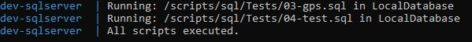
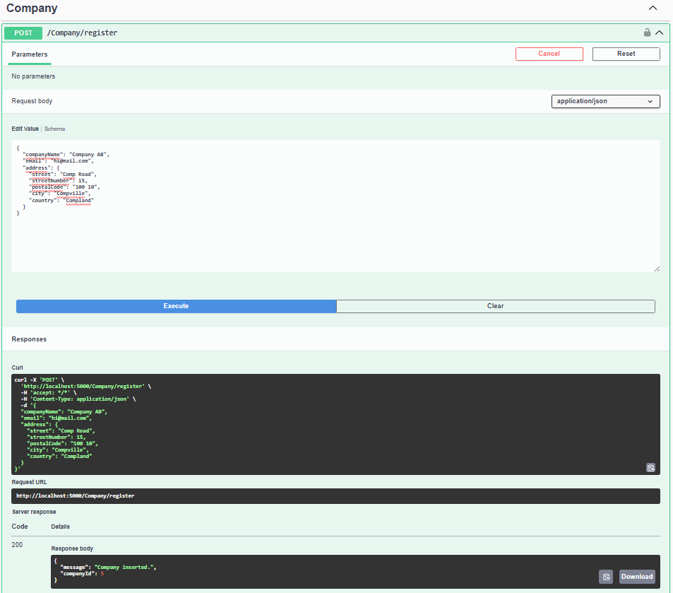
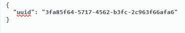
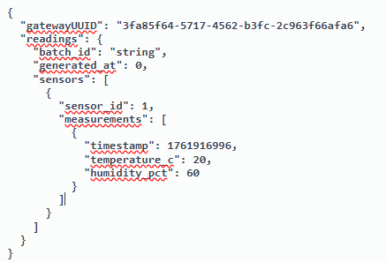
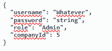
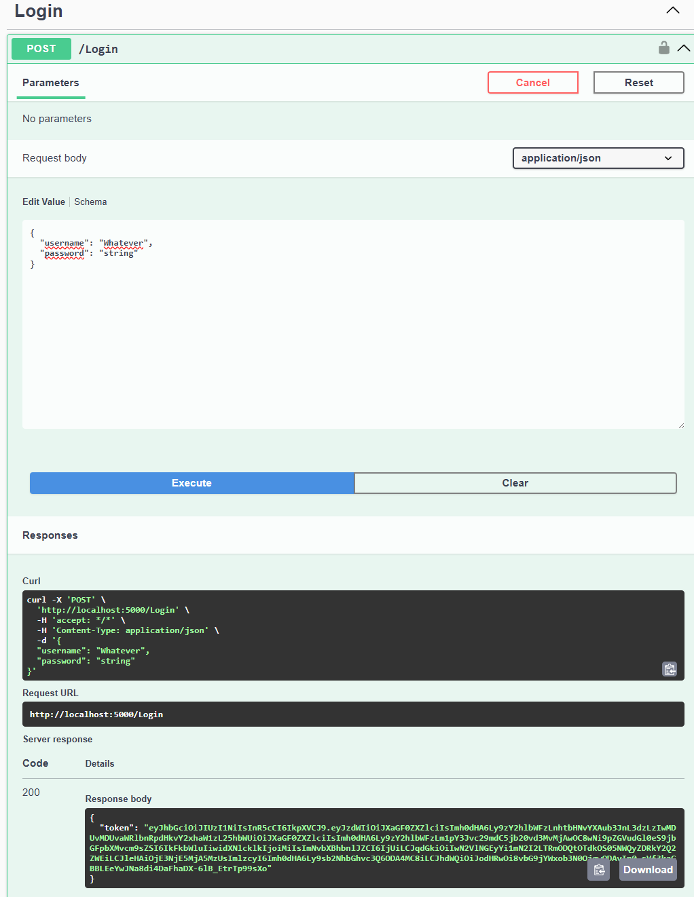
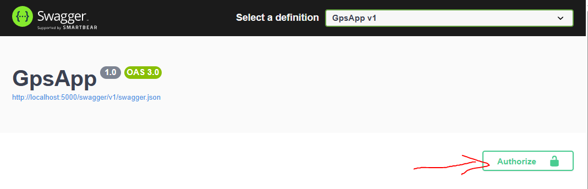

# Swagger Guide

## Description

Provided here, is a guide you can use to navigate through our production API Documentation([found here](https://g1api-bgeuc6hydmg9etgt.swedencentral-01.azurewebsites.net/swagger/index.html)).   

> [!WARNING]
> Production API documentation is not updated.
> Test the updated version in development localhost.

[Link here](../README.md#getting-started) to run a container and connect to `http://localhost:5000/swagger/index.html`.  

We are using Swagger because of its reliability and ability to generate automated documentation written in the source code.   
Automation is a key part of our curriculum as it also removes alot of the possible human errors that can occur.  

## Guide

### 1. Get started

1.1 Run `docker-compose.yml` in root repository.  
  
1.2 Wait until SQL Server is ready and open `http://localhost:5000/swagger/index.html` to access Swagger and our endpoints.  

> [!IMPORTANT]
> If you want to try a route click the button **Try it out** in the top right corner of every route.  

### 2. Create a company

2.1 Register a company under Company/register or use an existing one like `Carrier Logistics AB`.  
  
2.2 The companyId created in the bottom will be used later. `Carrier Logistics AB` uses the Id 5.  

### 2. Create a Gateway

2.1 Locate Gateway/insert header and create a valid deviceId that will be used for sending sensor batch readings.  
Adapt the value so it looks like the image below.  
  

### 3. Insert a sensor batch reading

3.1 Locate Sensor/batch   
3.2 Insert a new sensor batch with a valid UNIX timestamp, a valid id and a valid gatewayid that matches the previous inserted gateway value from batch like below.  

### 4. Sign up an account

4.1 Locate /Signup  
4.2 Create a new user/admin and connect the companyId you want to use. We are using the id `5` because it was generated from before.  
  

### 5. Login

5.1 Locate /Login  
5.2 Retreive the generated JWT token under response body, copy it.  
  
5.3 Locate the Authorize button in the top of the document and click it.  
  
5.4 Paste your newly generated token and authorize and if successful, this will allow you to list deliveries.  

### 6. List deliveries

6.1 Locate Delivery/retrieveDeliveries.  
6.2 Retrive a list of a single id under Delivery/{id} or list all deliveries under /Delivery/retrieveDeliveries  
6.3 If all goes well you should see a new delivery made with the new batch readings under currentTemp and currentHumid under the response body.  
The timestamp is converted into a human readable format.  

6.4 If you want to create more deliveries, jump to [step number 3](#3-insert-a-sensor-batch-reading) and insert a new sensor batch.  

### Finish

Remember to run `docker-compose down -v` to clear the data in the container.
