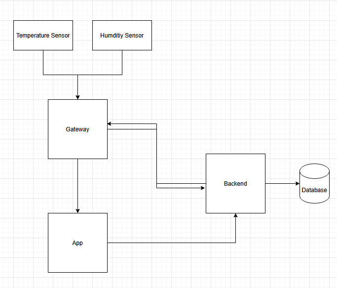

# System Overview

## Components

Sensors	Collect environmental data (temperature, humidity)
Gateway	Acts as an edge device; receives data from sensors and forwards it
Backend API	Receives and stores sensor data (C#, Dotnet)
Database	Stores sensor data (SQL Server)
Frontend App	Displays real-time and historical sensor data
CI/CD Pipeline	Builds and deploys backend container, and redeploys on updates

## reprensation
Sensor->>Gateway: Send JSON data
Gateway->>Backend: POST /Gps or similar
Backend->>DB: Store data
Frontend->>Backend: GET /GpsGet
Backend->>Frontend: Return data for display

